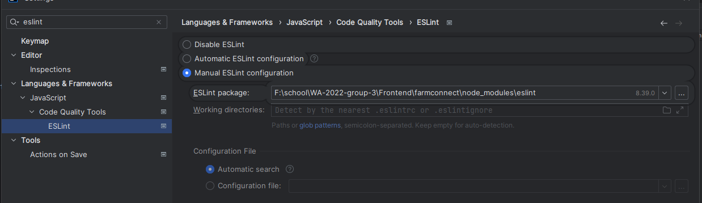
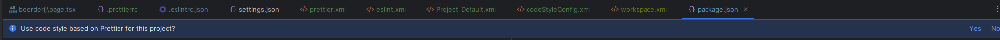
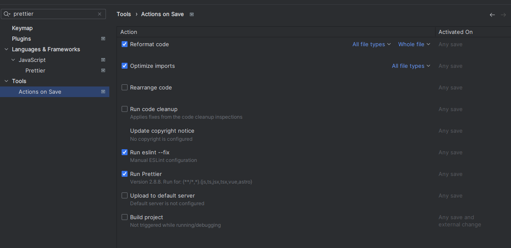

This is a [Next.js](https://nextjs.org/) project bootstrapped
with [`create-next-app`](https://github.com/vercel/next.js/tree/canary/packages/create-next-app).

## Setting up the project

1. Clone the project
2. Run npm install in the project directory
3. Enable ESLint in your IDE
   
4. Enable Prettier in your IDE
   
5. Enable Eslint and Prettier on save in your IDE
   

## Getting Started

First, run the development server:

```bash
npm run dev
```

Open [http://localhost:3000](http://localhost:3000) with your browser to see the result.
