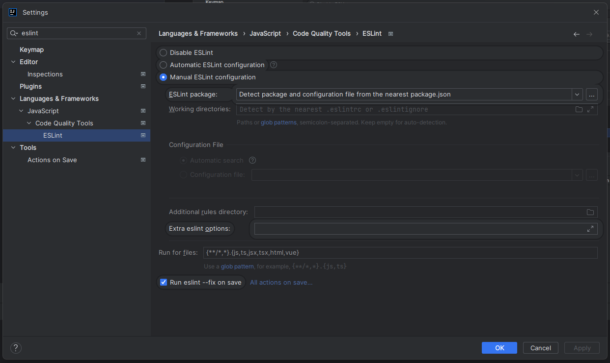
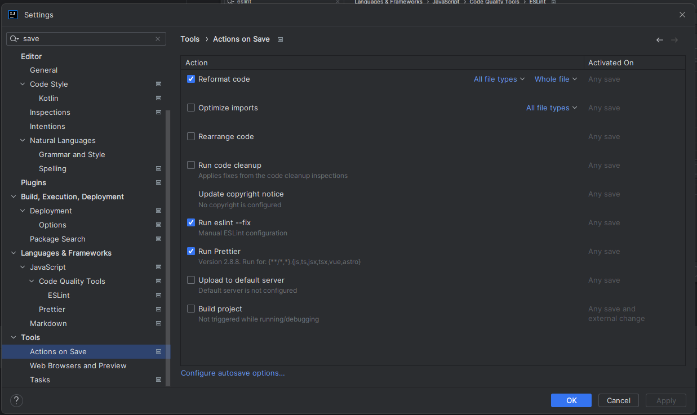

## Setting up the project

1. Clone the project
2. Run npm install-all in the project directory
3. Enable ESLint in your IDE

4. Enable Eslint and Prettier on save in your IDE

## Checking code quality
To check code quality, run the following commands in the project directory:
1. npm run check-lint to check for linting errors
2. npm run format to format the code with prettier
3. npm run check-format to check for formatting errors with prettier

## Running the project
To run the project, run the following commands in the project directory:
1. npm run-all-dev to run the project in development mode

